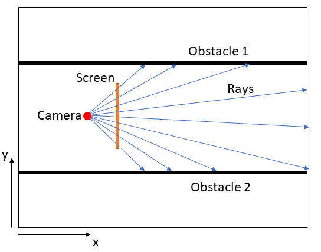
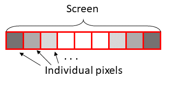

# **Project: 2D Ray Tracing**

Idea contributed by Patrick Schmidt (ps.schmidt@tum.de).

## **Motivation**

Ray tracing is a technique used in computer graphics to render a field of view on geometric objects into an image that is displayed to the user. To allow for high resolution and high frame rates the program's performance must be optimized. To implement such a performance-critical application C++ is an obvious choice for its rich standard library and optimization possibilities.

In this project C++ will be used to implement a scalable 2D ray tracer from ground up. User interaction and display will be handled using the SDL library. It will be very useful to use OOP (object-oriented programming) concepts. For example "Wall" and "Coordinate" could be implemented as classes.

## *2D Ray Tracing Basics*

We start by creating a virtual plane, on which a "camera" and some geometric shapes are placed.

In front of the camera we can imagine a 1D screen, essentially one row of pixels. Originating at the camera one ray goes through the center of each pixel and into the plane. If a ray hits an obstacle (a shape), the distance from the obstacle to the camera is calculated. Thereby each pixel gets assigned a distance from the closest obstacle, or in case the ray does not hit any obstacle, infinity.

We then represent the distance as visual information, for example as the brightness of a pixel. This way the camera's viewpoint can be displayed to the user.

## **Sprint 1**

In this sprint, an application will be built that renders a field of view in a 2D plane. Geometric objects can be placed by the programmer. The static field of view is visible to the user as console output. 

### **Definion of "done"**

* In the language of linear algebra the following concepts are implemented:
    * a camera
    * rays originating from the camera
    * one or more obstacles
* A one-dimensional container representing the screen is implemented (choose a resolution)
* The distance from camera to obstacle is determined for each pixel in the screen (use linear algebra)
* The screen is shown to the user as console output (maybe using ASCII art?)

## **Sprint 2**

In this sprint, user interaction will be implemented. For this the library SDL will be installed and included ([Tutorial](https://lazyfoo.net/tutorials/SDL/01_hello_SDL/index.php)). The user can move his position on a 2D plane and adjust his field of view.

### **Definion of "done"**

* The library SDL is installed 
* Instead of showing the screen as console output, the screen is displayed in an SDL window
* The screen is updated at a fixed frequency (frame rate)
* Event handlers are implemented:
    * The X-Y position of the camera can be adjusted using the arrow keys
    * The field of view can be rotated left-right using the mouse
 

## **Sprint 3**

In this sprint the application will be profiled and its performance will be improved. Techniques for improving performance as covered by the lecture will be applied.

### **Definion of "done"**

* The average calculation time per frame is saved as a .log file after the program is closed
* From this the maximum possible framerate is extrapolated and saved in the .log file
* Rate limiting steps of the program are identified
* The efficiency of the program is improved by enhancing these steps